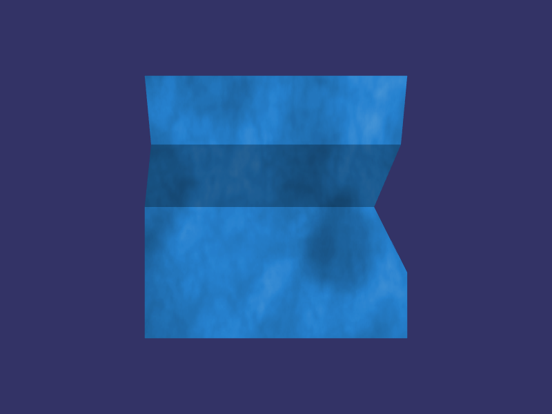

# Table of contents

* [Overview](#overview)
* [Steps](#steps)
    * [1.1. Generate resources](#generate)
    * [1.2. Build OpenSceneGraph with PNG support](#plugins)
        * [Linux, Windows](#linuxwindows)
        * [macOS](#macos)
        * [iOS](#ios)
        * [Android](#android)
        * [Web](#web)
    * [1.3. Provide shader resources as strings](#shaders)
    * [1.4. Provide image resource as a texture](#image)
    * [1.5. Apply shaders and texture to the scene](#scene)
* [Result](#result)

<a name="overview"/>

# Overview

This example is part of [OpenSceneGraph cross-platform examples][osgcpe].

In this example we use PNG image as a texture for a model. All resources are
embedded into application.

**Non-desktop platforms' note**: don't forget to reference OpenSceneGraph plugins with `USE_OSGPLUGIN` macro.

<a name="steps"/>

# Steps

<a name="generate"/>

## 1.1. Generate resources

We need to have the following files generated:

* `ppl.frag.h`: per-pixel lighting fragment shader
* `ppl.vert.h`: per-pixel lighting vertex shader
* `digit.png.h`: image to use as a texture

**Note**: see [01.EmbedResource][ex01] for details on resource generation and embedding.

<a name="plugins"/>

## 1.2. Build OpenSceneGraph with PNG support

OpenSceneGraph has two plugins capable of loading PNG images:

* `png`
    * uses [libpng][libpng] library
    * available for all platforms
    * plugin file: `osgdb_png.so` or `libosgdb_png.a`
    * linking in CMakeLists.txt:
        ```
        - - - -
        TARGET_LINK_LIBRARIES(
        - - - -
            osgdb_png
            png
        - - - -
        ```
* `imageio`
    * uses [Image I/O][imageio] library
    * only available for Apple platforms
    * plugin file: `osgdb_imageio.so` or `libosgdb_imageio.a`
    * linking in CMakeLists.txt:
        ```
        - - - -
        TARGET_LINK_LIBRARIES(
        - - - -
            osgdb_imageio
            imageio
        - - - -
        ```

**macOS, iOS note**: since Apple provides [Image I/O][imageio] library to work
with popular image formats, you don't need to use any additional dependency to
work with PNG.

<a name="linuxwindows"/>

### Linux, Windows

You should generally use package managers ([MSYS2][msys2] for Windows) to install
OpenSceneGraph because they provide OpenSceneGraph with `png` plugin by default.

If you build OpenSceneGraph from sources, you need to make sure `libpng` is found
by `CMake` during configuration stage. Consult `CMake`'s [FindPNG][find-png] documentation
for details.

<a name="macos"/>

### macOS

If you installed OpenSceneGraph with [brew][brew], you already have
`imageio` plugin installed.

If you built OpenSceneGraph from sources, `CMake` should have found `Image I/O`
during configuration stage.

<a name="ios"/>

### iOS

OpenSceneGraph should have detected and built `Image I/O` plugin. So you should have no problems.

<a name="android"/>

### Android

First, download [libpng-android][libpng-android] and place it alongside this
repository (next to OpenSceneGraph).

Second, reference `libpng-android` from `CMakeLists.txt` ([source code][cmake-libpng]):

```
- - - -
# Reference libpng-android.
SET(PNG_SOURCE_DIR "${EXT_PROJ_DIR}/libpng-android")
SET(PNG_BUILD_DIR "${PNG_SOURCE_DIR}/build/${ANDROID_ABI}")
# Only build libpng-android if it has not yet been built.
IF (NOT EXISTS "${PNG_BUILD_DIR}/libpng.a")
    FILE(MAKE_DIRECTORY ${PNG_BUILD_DIR})
    ADD_SUBDIRECTORY(${PNG_SOURCE_DIR} ${PNG_BUILD_DIR})
ENDIF ()
# Reference libpng-android includes.
INCLUDE_DIRECTORIES(${PNG_SOURCE_DIR}/jni)
# Reference libpng-android libraries.
LINK_DIRECTORIES(${PNG_BUILD_DIR})
# Force PNG specific flags for OSG.
SET(PNG_FOUND ON CACHE BOOL "PNG is found")
SET(OSG_CPP_EXCEPTIONS_AVAILABLE ON CACHE BOOL "Enable exceptions to build PNG")
SET(PNG_INCLUDE_DIR ${PNG_SOURCE_DIR}/jni)
- - - -
```

<a name="web"/>

### Web

[Emscripten][emscripten] ships `libpng` itself. However, to use it, we need to
perform several compile time tricks.

First, provide `USE_LIBPNG` and `USE_ZLIB` flags at compile and link times
([source code][cmake-png]):

```
- - - -
SET(BUILD_FLAGS "-O3 -s USE_SDL=2 -s ALLOW_MEMORY_GROWTH=1 -s USE_LIBPNG=1 -s USE_ZLIB=1")
ADD_DEFINITIONS(${BUILD_FLAGS})
- - - -
SET_TARGET_PROPERTIES(ex02-texture-image PROPERTIES LINK_FLAGS ${BUILD_FLAGS})
- - - -
```

Second, force PNG detection ([source code][cmake-force-png]):
```
SET(PNG_PNG_INCLUDE_DIR "whatever" CACHE STRING "Force PNG detection")
SET(PNG_LIBRARY "libpng" CACHE STRING "Force PNG detection")
SET(ZLIB_INCLUDE_DIR "whatever" CACHE STRING "Force ZLIB detection")
SET(ZLIB_LIBRARY "zlib" CACHE STRING "Force ZLIB detection")
SET(OSG_CPP_EXCEPTIONS_AVAILABLE ON CACHE BOOL "Force PNG plugin building")
```

**Notes**:

* ignore `WARNING:root:emcc: cannot find library "libpng"` errors: they arise because `libpng` is taken from Emscripten ports and not as explicit files like OpenSceneGraph
* make sure there are no `warning: unresolved symbol: png_read_info` errors, because they mean `libpng` have not been linked with

<a name="shaders"/>

## 1.3. Provide shader resources as strings

[01.EmbedResource][ex01] example provides shaders as simple [strings][ex01-shaders].
This worked fine for single line shaders. 

Now that we need more complex shaders to apply textures, it's easier to manage
shaders separately from application's source code. That's why shaders are now
resources.

Let's see how to convert a resource to a string ([source code][resource-string]):

```
std::string string(const Resource &resource)
{
    const char *contents = reinterpret_cast<const char *>(resource.contents);
    return std::string(contents, resource.len);
}
```

**Note**: we casted `unsigned char *` (originally provided by `xxd`) to
`const char *`.


Let's see how to provide shader resources as strings to other functions
([source code][resource-string-usage]):

```
// Create shader program.
auto prog =
    render::createShaderProgram(
        resources::string(shaderVert),
        resources::string(shaderFrag)
    );
```

Finally, `shaderVert` and `shaderFrag` are defined like this
([source code][shaders-definition]):

```
osgcpe::Resource shaderFrag("shaders", "ppl.frag", ppl_frag, ppl_frag_len);
osgcpe::Resource shaderVert("shaders", "ppl.vert", ppl_vert, ppl_vert_len);
```

<a name="image"/>

## 1.4. Provide image resource as a texture

First, we need to read an image from a resource. Here's how the crucial part
of the implementation looks like ([complete version][resource-setTextureImage]):

```
- - - -
auto reader =
    osgDB::Registry::instance()->getReaderWriterForExtension(ex);
if (reader)
{
    ResourceStreamBuffer buf(resource);
    std::istream in(&buf);
    auto result = reader->readImage(in, 0);
    if (result.success())
    {
        // NOTE I could not get resulting osg::Image outside the function.
        // NOTE Somehow just returning result.getImage() does not work.
        texture->setImage(result.getImage());
    }
- - - -
```

**Note**: we do not return the image outside the function because the image
gets deallocated by that time, that's we use the image before leaving the scope.

Second, we need to create a texture with that image
([source code][resource-createTexture]):

```
osg::Texture2D *createTexture(const Resource &resource)
{
    osg::ref_ptr<osg::Texture2D> tex = new osg::Texture2D;
    setTextureImage(tex, resource);
    tex->setWrap(osg::Texture2D::WRAP_S, osg::Texture2D::REPEAT);
    tex->setWrap(osg::Texture2D::WRAP_T, osg::Texture2D::REPEAT);
    tex->setFilter(osg::Texture::MIN_FILTER, osg::Texture::LINEAR_MIPMAP_LINEAR);
    tex->setFilter(osg::Texture::MAG_FILTER, osg::Texture::LINEAR);
    return tex.release();
}
```

<a name="scene"/>

# 1.5. Apply shaders and texture to the scene

The last step is to get scene's material and apply shaders with texture to the material ([source code][scene-textureImageScene]):

```
// Create shader program.
auto prog =
    render::createShaderProgram(
        resources::string(shaderVert),
        resources::string(shaderFrag)
    );
// Apply the program.
auto material = scene->getOrCreateStateSet();
material->setAttribute(prog);
// Set texture image.
material->setTextureAttributeAndModes(0, resources::createTexture(textureImage));
material->addUniform(new osg::Uniform("image", 0));
```

<a name="result"/>

# Result



Here's a [web build of the example][web-build].

[osgcpe]: https://github.com/OGStudio/openscenegraph-cross-platform-examples
[osgcpg]: https://github.com/OGStudio/openscenegraph-cross-platform-guide
[ex01]: ../01.EmbedResource
[libpng]: http://www.libpng.org/pub/png/libpng.html
[imageio]: https://developer.apple.com/documentation/imageio
[msys2]: https://www.msys2.org/
[find-png]: https://cmake.org/cmake/help/v3.0/module/FindPNG.html
[brew]: https://brew.sh/
[ex01-shaders]: https://github.com/OGStudio/openscenegraph-cross-platform-examples/blob/master/01.EmbedResource/desktop/src/scene.h#L37
[resource-string]: https://github.com/OGStudio/openscenegraph-cross-platform-examples/blob/master/02.TextureImage/desktop/src/resources.h#L126
[resources-string-usage]: https://github.com/OGStudio/openscenegraph-cross-platform-examples/blob/master/02.TextureImage/desktop/src/scene.h#L45
[shaders-definition]: https://github.com/OGStudio/openscenegraph-cross-platform-examples/blob/master/02.TextureImage/desktop/src/Example.h#L81
[resource-setTextureImage]: https://github.com/OGStudio/openscenegraph-cross-platform-examples/blob/master/02.TextureImage/desktop/src/resources.h#L138
[resource-createTexture]: https://github.com/OGStudio/openscenegraph-cross-platform-examples/blob/master/02.TextureImage/desktop/src/resources.h#L192
[scene-textureImageScene]: https://github.com/OGStudio/openscenegraph-cross-platform-examples/blob/master/02.TextureImage/desktop/src/scene.h#L39
[emscripten]: http://emscripten.org/
[web-build]: https://ogstudio.github.io/openscenegraph-cross-platform-examples-web-builds/examples/02/ex02-texture-image.html
[libpng-android]: https://github.com/julienr/libpng-android
[cmake-libpng]: https://github.com/OGStudio/openscenegraph-cross-platform-examples/blob/master/02.TextureImage/android/app/CMakeLists.txt#L8
[cmake-png]: https://github.com/OGStudio/openscenegraph-cross-platform-examples/blob/master/02.TextureImage/web/CMakeLists.txt#L20
[cmake_png_plugin]: https://github.com/OGStudio/openscenegraph-cross-platform-examples/blob/master/02.TextureImage/web/CMakeLists.txt#L66
[cmake-force-png]: https://github.com/OGStudio/openscenegraph-cross-platform-examples/blob/master/02.TextureImage/web/CMakeLists.txt#L31
