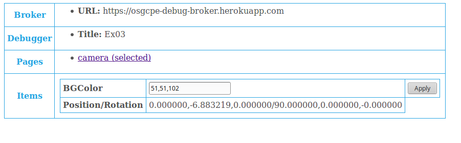

# Table of contents

* [Overview](#overview)
* [Architecture](#architecture)
* [Steps](#steps)
    * [2.1. Implement guest side classes](#guest)

* [Result](#result)

TODO explain features:

* Application+frame+Reporting
* Reporter+Stub
* Application+HTTPClientProcessor

* HTTPClientProcessor (desktop + web)

* HTTPRequestProcessorMongoose (desktop)
* extlib-mongoose (desktop)

* HTTPRequestProcessorFetch (web)
* extlib-fetch (web)

Android C++:
* library+httpClient-android
* library+jniStrings-android

Android Java:
* library+httpClient
* HTTPClientProcessor
* HTTPRequest
* HTTPRequestDelegate
* MainActivity+HTTPClientProcessor

iOS C++:
* library+httpClient-ios

iOS Objective-C:
* AppDelegate+HTTPClientProcessor
* HTTPClientProcessor

<a name="overview"/>

# Overview

This example is part of [OpenSceneGraph cross-platform examples][osgcpe].

In this example we implement HTTP (with TLS support) client across platforms
to perform GET/POST requests.

**Note**: this example builds on the [previous one][ex-prev], make sure to study it.

<a name="architecture"/>

# Architecture

Each platform has its own stack of technologies to perform HTTP(s) requests:

* Desktop can utilize almost any library (we use [Mongoose][mongoose] with [OpenSSL][openssl])
* Web (Emscripten) provides so-called [FetchAPI][fetch-api]
* Android provides [HttpURLConnection][http-url-connection] in Java
* iOS provides [NSURLSession][ns-url-session] in Objective-C

Such a variaty of platform specific technologies is best addressed by
implementing host-guest relationship:

* guest (platform agnostic)
    * provides networking representation
    * used by cross-platform C++ code
* host (specific platform)
    * polls guest for pending requests
    * processes them
    * reports results back to the guest

<a name="steps"/>

# Steps

<a name="guest"/>

## 2.1. Implement guest side classes

Guest side contains the following classes:

* [HTTPClient][http-client]
    * provides `get(...)` function to perform HTTP(s) GET request
    * provides `post(...)` function to perform HTTP(s) POST request
    * manages `HTTPRequest` instances
* [HTTPRequest][http-request]
    * contains URL
    * contains payload
        * if payload is empty, hosts perform GET request
        * if payload is non-empty, hosts perform POST request
    * contains success and failure callbacks

Cross-platform client code uses `HTTPClient` exclusively to perform HTTP(s) requests.

<a name="desktop"/>

## 2.2. Implement HTTPClientProcessor for desktop and web hosts

Both desktop and web use [HTTPClientProcessor][http-client-processor]:

* processes single `HTTPClient` instance
* is [regularly called][http-client-processor-processing] by `Application` to process requests
* creates either `HTTPClientProcessorMongoose`, or `HTTPClientProcessorFetch` instance for each `HTTPRequest` instance

## 2.3. Implement HTTPClientProcessorMongoose for desktop host

We chose [Mongoose][mongoose] over numerous other options because it's
easy to use and integrate.

[HTTPClientProcessorMongoose]:
    * uses `Mongoose`
    * accepts and alters single `HTTPRequest` instance

To support requests to HTTPS, make sure to:

* [enable OpenSSL support in Mongoose][mongoose-openssl]
* [link with OpenSSL libraries][link-openssl]


## 2.?. Change background (camera) color when GET/POST responses arrive

Specific example:
* Application+HTTPClient
* Application+camera
* Example+HTTPSGetPost

Client code uses `HTTPClient` exclusively to perform HTTP(s) requests
([source code][https-get-post]):

```
// Reset background color.
this->app->camera()->setClearColor({ 0, 0, 0, 0 });
// Set background color 50% greener on success.
auto success = [&](std::string response) {
    auto color = this->app->camera()->getClearColor();
    color.y() += 0.5;
    this->app->camera()->setClearColor(color);
    OSGCPE_EXAMPLE_LOG(response.c_str());
};
// Set background color 50% redder on failure.
auto failure = [&](std::string reason) {
    auto color = this->app->camera()->getClearColor();
    color.x() += 0.5;
    this->app->camera()->setClearColor(color);
    OSGCPE_EXAMPLE_LOG(reason.c_str());
};

// GET.
this->app->httpClient->get(
    "https://raw.githubusercontent.com/OGStudio/openscenegraph-cross-platform-examples/master/.gitignore",
    success,
    failure
);

// POST.
this->app->httpClient->post(
    "https://opengamestudio-debug-broker.herokuapp.com",
    "sample-data",
    success,
    failure
);
```

<a name="result"/>

# Result



Here's a [web build of the example][web-build].

[osgcpe]: https://github.com/OGStudio/openscenegraph-cross-platform-examples
[ex-prev]: ../02.TextureImage

[mongoose]: https://github.com/cesanta/mongoose
[openssl]: https://www.openssl.org
[fetch-api]: https://kripken.github.io/emscripten-site/docs/api_reference/fetch.html
[http-url-connection]: https://developer.android.com/reference/java/net/HttpURLConnection
[ns-url-session]: https://developer.apple.com/documentation/foundation/nsurlsession?language=objc

[http-client]: https://github.com/OGStudio/openscenegraph-cross-platform-examples/blob/Mahjong-17/03.HTTPClient/desktop/src/network.h#L194
[http-request]: https://github.com/OGStudio/openscenegraph-cross-platform-examples/blob/Mahjong-17/03.HTTPClient/desktop/src/network.h#L53
[reporter]: https://github.com/OGStudio/openscenegraph-cross-platform-examples/blob/Mahjong-17/03.HTTPClient/desktop/src/Reporter.h#L34
[http-client-processor]: https://github.com/OGStudio/openscenegraph-cross-platform-examples/blob/Mahjong-17/03.HTTPClient/desktop/src/network.h#L291
[http-client-processor-processing]: https://github.com/OGStudio/openscenegraph-cross-platform-examples/blob/Mahjong-17/03.HTTPClient/desktop/src/Application.h#L159
[mongoose-openssl]: https://github.com/OGStudio/openscenegraph-cross-platform-examples/blob/Mahjong-17/03.HTTPClient/desktop/src/network-extlib.h#L29
[link-openssl]: https://github.com/OGStudio/openscenegraph-cross-platform-examples/blob/Mahjong-17/03.HTTPClient/desktop/CMakeLists.txt#L27


[web-build]: https://ogstudio.github.io/openscenegraph-cross-platform-examples-web-builds/examples/03/ex03-http-client.html

