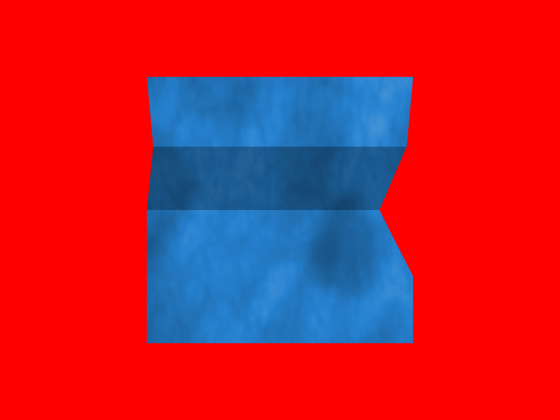

# Table of contents

* [Overview](#overview)
* [Steps](#steps)
    * [3.1. HTTP(s) support](#http)
* [Result](#result)

TODO:

Application+frame+Reporting
Application+CameraManipulator                        
Application+Debugging                                
Application+DebugCamera                              
Reporter+Stub 
Example+Debugging                                    
Example+DebugApplication                             

Example+HTTPClient  

HTTPClient

* Mongoose
* FetchAPI

Debug

* PageDesc
* Page
* Debugger
* JSON nlohmann's

<a name="overview"/>

# Overview

This example is part of [OpenSceneGraph cross-platform examples][osgcpe].

In this example we implement [debug-broker][debug-broker]'s protocol to support remote
debugging across platforms.

<a name="steps"/>

# Steps

<a name="http"/>

## 3.1. HTTP(s) support

Remote debugging assumes application and debug UI are located at different
machines. The most widespread way to communicate between remote machines
nowadays is to use HTTP(s) over TCP/IP.

We use the following technologies to have HTTP(s) support across platforms:

* [FetchAPI][fetch-api]
    * is only used under web
    * is [Emscripten][emscripten]'s way to make us of [XHR][xhr]
* [Mongoose][mongoose]
    * is used under desktop and mobile
    * is easy to integrate and supports TLS

These technologies are mapped into the following classes:

* [HTTPClientFetch][http-fetch]
    * supports only single request per instance
    * currently only handles responses up to 1024 characters
* [HTTPClientMongoose][http-mongoose]
    * supports only single request per instance
    * requires client code to call its `process()` function regularly to process the request
* [HTTPClient][http-common]
    * supports any number of requests per instance by creating and destroying as many HTTPClientFetch/Mongoose instances as necessary
    * requires client code to call its `process()` function regularly to process requests

<a name="result"/>

# Result

Here's a [web build of the example][web-build].

[osgcpe]: https://github.com/OGStudio/openscenegraph-cross-platform-examples
[debug-broker]: https://github.com/OGStudio/debug-broker
[fetch-api]: https://kripken.github.io/emscripten-site/docs/api_reference/fetch.html
[emscripten]: http://emscripten.org
[xhr]: https://en.wikipedia.org/wiki/XMLHttpRequest
[mongoose]: https://github.com/cesanta/mongoose
[http-fetch]: https://github.com/OGStudio/openscenegraph-cross-platform-examples/blob/master/03.RemoteDebugging/web/src/network.h#L48
[http-mongoose]: https://github.com/OGStudio/openscenegraph-cross-platform-examples/blob/master/03.RemoteDebugging/desktop/src/network.h#L38
[http-common]: https://github.com/OGStudio/openscenegraph-cross-platform-examples/blob/master/03.RemoteDebugging/desktop/src/network.h#L145
