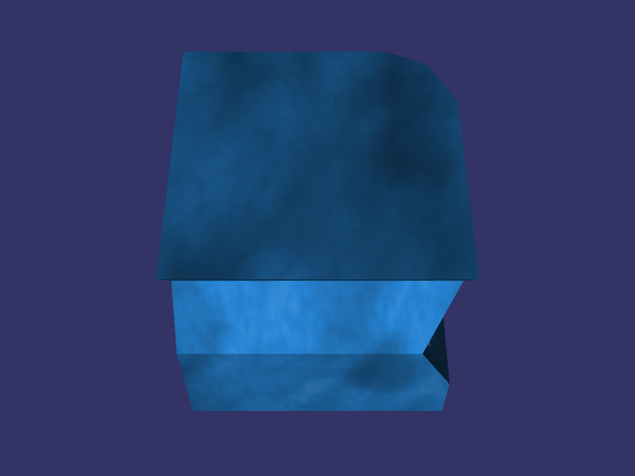

# Table of contents

* [Overview](#overview)
* [Steps](#steps)
    * [5.1. Input support across platforms](#input-support)
        * [5.1.1. Android](#input-android)
        * [5.1.2. Web](#input-web)
    * [5.2. Introduce Mouse class](#mouse)
    * [5.3. Mark scene node as selectable](#mark)
    * [5.4. Find a node at mouse position](#node)
    * [5.5. Rotate the node upon selection](#rotate)
* [Result](#result)

<a name="overview"/>

# Overview

This example is part of [OpenSceneGraph cross-platform examples][osgcpe].

In this example we implement node selection.

**Note**: this example requires [02.TextureImage example][ex02] knowledge.

<a name="steps"/>

# Steps

<a name="input-support"/>

## 5.1. Input support across platforms

OpenSceneGraph provides windowing system for desktop (Linux, macOS, Windows)
and iOS platforms. Input is working out of the box there.

However, OpenSceneGraph does not have windowing systems for Android and Web
(Emscripten), so we need to handle input events ourselves for these platforms.

### 5.1.1. Android

#### Receive events at Java side

First, implement `View.OnTouchListener` interface
([source code][android-receive-events-if]):

```
- - - -
public class MainActivity
- - - -
    implements ... View.OnTouchListener
- - - -
```

Second, listen to touch events ([source code][android-receive-events-listen]):

```
- - - -
EGLview renderer = (EGLview)findViewById(R.id.render_surface);
renderer.setOnTouchListener(this);
- - - -
```

#### Redirect events to C++ side

Implement `onTouch()` function to handle events and redirect them to C++ side
([source code][android-redirect-events]):

```
- - - -
@Override
public boolean onTouch(View view, MotionEvent event)
{
    int action = event.getAction() & event.ACTION_MASK;
    float x = event.getX(0);
    float y = event.getY(0);
    switch (action)
    {
        case MotionEvent.ACTION_DOWN:
        {
            library.handleMousePress(true, x, y);
            return true;
        }
        case MotionEvent.ACTION_UP:
        case MotionEvent.ACTION_CANCEL:
        {
            library.handleMousePress(false, x, y);
            return true;
        }
- - - -
```

#### Handle events at C++ side

First, implement `handleMousePress()` function in the native library
([source code][android-receive-events-native]):

```
- - - -
JNI_FUNC(handleMousePress)(JNI_ARG, jboolean down, jfloat x, jfloat y)
{
    example->app->handleMousePress(down == JNI_TRUE, x, y);
}
- - - -
```

Second, pass mouse events to OpenSceneGraph's event queue
([source code][android-pass-events]):

```
- - - -
auto queue = this->viewer->getEventQueue();
float correctedY = (this->windowHeight - y);
if (down)
{
    queue->mouseButtonPress(x, correctedY, 1 /* LMB */);
}
else
{
    queue->mouseButtonRelease(x, correctedY, 1 /* LMB */);
}
- - - -
```

**Notes**:

* we correct Y coordinate taking render window height into account
* we report all taps as left mouse button for simplicity

### 5.1.2. Web

#### Receive SDL events

Receive SDL events ([source code][web-receive-events]):

```
- - - -
SDL_Event e;
while (SDL_PollEvent(&e))
{
    example->app->handleEvent(e);
}
- - - -
```

#### Detect mouse and finger events

SDL makes clear distinction between mouse and finger events, so we need to
know which ones to accept ([source code][web-detect-event-source]):

```
- - - -
// Detect finger events.
if (
    e.type == SDL_FINGERMOTION ||
    e.type == SDL_FINGERDOWN ||
    e.type == SDL_FINGERUP
) {
    this->fingerEventsDetected = true;
}
// Handle mouse events unless finger events are detected.
if (!this->fingerEventsDetected)
{
    return this->handleMouseEvent(e, queue);
}
// Handle finger events.
return this->handleFingerEvent(e, queue);
- - - -
```

#### Handle mouse and finger events

First, handle mouse events ([source code][web-handle-mouse-events]):

```
- - - -
bool handleMouseEvent(const SDL_Event &e, osgGA::EventQueue &queue)
{
    switch (e.type)
    {
        case SDL_MOUSEMOTION: {
            auto correctedY = -(this->windowHeight - e.motion.y);
            queue.mouseMotion(e.motion.x, correctedY);
            return true;
        }
        case SDL_MOUSEBUTTONDOWN: {
            auto correctedY = -(this->windowHeight - e.button.y);
            queue.mouseButtonPress(e.button.x, correctedY, e.button.button);
            return true;
        }
        case SDL_MOUSEBUTTONUP: {
            auto correctedY = -(this->windowHeight - e.button.y);
            queue.mouseButtonRelease(e.button.x, correctedY, e.button.button);
            return true;
        }
- - - -
```

Second, handle finger events ([source code][web-handle-finger-events]):

```
- - - -
bool handleFingerEvent(const SDL_Event &e, osgGA::EventQueue &queue)
{
    int absX = this->windowWidth * e.tfinger.x;
    int absY = this->windowHeight * e.tfinger.y;
    auto correctedY = -(this->windowHeight - absY);
    switch (e.type)
    {
        case SDL_FINGERMOTION:
            queue.mouseMotion(absX, correctedY);
            return true;
        case SDL_FINGERDOWN:
            queue.mouseButtonPress(absX, correctedY, e.tfinger.fingerId);
            return true;
        case SDL_FINGERUP:
            queue.mouseButtonRelease(absX, correctedY, e.tfinger.fingerId);
            return true;
- - - -
```

<a name="mouse"/>

## 5.2. Introduce Mouse class

Let's handle OpenSceneGraph mouse events with the help of
[Mouse][Mouse]:

* implements `osgGA::GUIEventAdapter::handle()` to be able to accept OpenSceneGraph events
* [is registered][Mouse-register] to `osgViewer::Viewer` to actually accept events
* keeps current mouse position and a list of pressed mouse buttons
* reports changes in mouse position and pressed buttons

<a name="mark"/>

## 5.3. Mark scene node as selectable

To tell selectable scene nodes from non-selectable ones apart, we need to mark
necessary ones as selectable. One way to do so is to use node masks.

By default, each scene node has `0xFFFFFFFF` mask. Let's exclude specific
bit from those scene nodes that we want to mark as selectable. Since our
scene only contains a single box node, we mark the whole scene
([source code][node-mask]):

```
- - - -
const unsigned int selectionNodeMask = 0x00000004;
- - - -
// Make box node selectable by excluding specific node mask.
this->scene->setNodeMask(
    this->scene->getNodeMask() & ~this->selectionNodeMask
);
- - - -
```

<a name="node"/>

## 5.4. Find a node at mouse position

To find a node at mouse position, we check what mouse position intersects
with from the point of view of the camera ([source code][intersection]):

```
- - - -
// Find intersections.
osg::ref_ptr<osgUtil::LineSegmentIntersector> intersector =
    new osgUtil::LineSegmentIntersector(
        osgUtil::Intersector::WINDOW,
        position.x(),
        position.y()
    );
osgUtil::IntersectionVisitor iv(intersector.get());
camera->accept(iv);
- - - -
// Get closest intersection.
auto intersection = intersector->getFirstIntersection();
for (auto node : intersection.nodePath)
{
    // Make sure node mask is excluded.
    if ((node->getNodeMask() & excludedNodeMask) != excludedNodeMask)
    {
        return node;
    }
}
- - - -
```

<a name="rotate "/>

## 5.5. Rotate the node upon selection

Use [LinearInterpolator][LinearInterpolator] to rotate the node
during time interval ([source code][rotate]):

```
- - - -
// Get current box rotation along X.
auto rot = scene::simpleRotation(this->scene);
auto srcX = rot.x();

// Configure interpolation.
this->interpolator.keyValues = {
    {0, srcX},
    {0.5, srcX + 45}, // Rotate by 45 degrees in 0.5 seconds.
    {2, srcX}, // Rotate back in 2 - 0.5 = 1.5 seconds.
};
- - - -
```

<a name="result"/>

# Result



Here's a [web build of the example][web-build].

[osgcpe]: https://github.com/OGStudio/openscenegraph-cross-platform-examples
[ex02]: ../02.TextureImage

[android-receive-events-if]: android/app/src/main/java/MainActivity.java#L79
[android-receive-events-listen]: android/app/src/main/java/MainActivity.java#L126
[android-redirect-events]: android/app/src/main/java/MainActivity.java#L131
[android-receive-events-native]: android/app/src/main/cpp/library.cpp#L71
[android-pass-events]: android/app/src/main/cpp/main.h#L166

[web-receive-events]: web/src/main.cpp#L38
[web-detect-event-source]: web/src/main.h#L187
[web-handle-mouse-events]: web/src/main.h#L239
[web-handle-finger-events]: web/src/main.h#L217

[Mouse]: desktop/src/input.h#L84
[Mouse-register]: desktop/src/main.h#L247
[node-mask]: desktop/src/main.h#L422
[intersection]: desktop/src/scene.h#L114
[LinearInterpolator]: desktop/src/scene.h#L176
[rotate]: desktop/src/main.h#L338

[web-build]: https://ogstudio.github.io/openscenegraph-cross-platform-examples-web-builds/examples/05/ex05-node-selection.html
