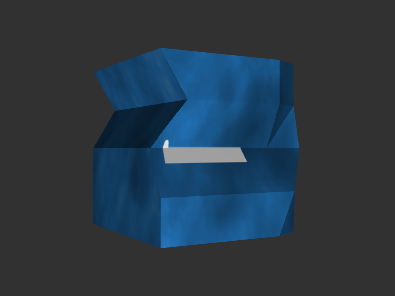

# Table of contents

* [Overview](#overview)
* [Steps](#steps)
    * [6.1. Get to know Reporter](#reporter)
    * [6.2. Introduce Sequence](#sequence)
    * [6.3. TODO](#todo)
* [Result](#result)

<a name="overview"/>

# Overview

This example is part of [OpenSceneGraph cross-platform examples][osgcpe].

In this example we create an asynchronous command sequence to combine
animations with other operations.

**Note**: this example requires [05.NodeSelection example][ex05] knowledge.

<a name="steps"/>

# Steps

<a name="reporter"/>

## 6.1. Get to know Reporter

Previous examples used `Reporter` class, which was not explained before.
`Reporter` is at the core of asynchronous operations. `Reporter` is a simple
implementation of powerful [publish-subscribe pattern][pattern].

### 6.1.1. Theory

To make a class be able to report changes to any number of
listeners, the class has to have an instance of `Reporter`. Whenever the class
wants to report changes, the class should call `Reporter`'s `report()`
function.

The listening parties should subscribe to the instance
of `Reporter` with its `addCallback()` function.

### 6.1.2. Practice

Here's how we subscribe to be notified of each frame event
([source code][reporter-subscription]):

```
this->app->frameReporter.addCallback(
    [&] {
        this->rotateBox();
    },
    this->boxRotationCallbackName
);
```

And here's how the "main loop" drives `frameReporter` instance of `Reporter`
([source code][reporter-reporting]):

```
void frame()
{
    this->viewer->frame();
    this->frameReporter.report();
}
```

<a name="sequence"/>

## 6.2. Introduce Sequence

In order to have a command sequence of asynchronous operations, we need
to combine several `Reporter` instances.

<a name=""/>

## 6.3. TODO

To tell selectable scene nodes from non-selectable ones apart, we need to mark

<a name="result"/>

# Result



Here's a [web build of the example][web-build].

[osgcpe]: https://github.com/OGStudio/openscenegraph-cross-platform-examples
[ex05]: ../05.NodeSelection
[pattern]: https://en.wikipedia.org/wiki/Publish%E2%80%93subscribe_pattern
[reporter-subscription]: desktop/src/main.h#L471
[reporter-reporting]: desktop/src/main.h#L153

[web-build]: https://ogstudio.github.io/openscenegraph-cross-platform-examples-web-builds/examples/06/ex06-command-sequence.html
